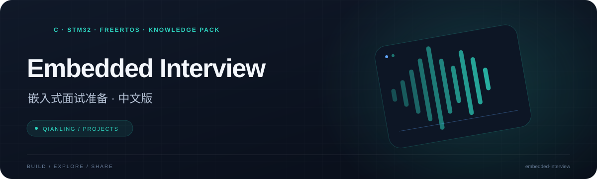

<p align="center"></p>

<h1 align="center">Embedded Interview · 嵌入式面试准备 · 中文版</h1>

<p align="center">从 C 语言基础到 RTOS 与系统设计，将练习、参考答案和知识包放在一起。</p>

<p align="center">  </p>

<p align="center"><a href="#qwen--rag-markdown-知识包">Qwen / RAG Markdown 知识包</a> &nbsp; · &nbsp; <a href="#内容目录">内容目录</a> &nbsp; · &nbsp; <a href="#推荐学习顺序">推荐学习顺序</a> &nbsp; · &nbsp; <a href="#使用方法">使用方法</a></p>

---

## 项目概览

| 方向 | 内容 |
| --- | --- |
| **基础训练** | C、内存、中断与裸机外设 |
| **工程主题** | RTOS、通信协议、Linux 与 IoT |
| **知识复用** | 按题答配对的中文 Markdown 知识包 |

本仓库翻译自 [Amir7698/embedded-interview-prep](https://github.com/Amir7698/embedded-interview-prep)，覆盖嵌入式 C、内存、中断、裸机外设、FreeRTOS、通信协议、嵌入式 Linux、IoT、系统设计与综合面试题。

中文版保留了原仓库的目录结构、代码和参考实现。题目、理论说明、练习要求及大部分代码注释已转换为简体中文；少数答案源码仍保留英文注释，以避免自动翻译损害技术准确性。

## Qwen / RAG Markdown 知识包

需要导入面试助手时，优先使用 [`embedded/`](./embedded/) 目录。该目录已按主题整理为 13 个 Markdown 文件，并把每个任务的题目与对应答案放在同一个知识单元中；综合八股文也已按题号配对，适合 Qwen 直接生成口述回答。

- 入口文件：[`embedded/00_知识包说明.md`](./embedded/00_知识包说明.md)
- 可重新生成：`python tools/build_knowledge_pack.py`
- 原始 `.c` 练习仍保留，用于手写和编译训练。

## 内容目录

| 目录 | 核心内容 |
| --- | --- |
| `01_C_Fundamentals` | 位操作、指针、结构体、`volatile`、`const`、`static`、字节序 |
| `02_Memory` | 栈与堆、内存池、链接器段、内存映射 I/O |
| `03_Interrupts_and_ISR` | ISR、环形缓冲区、临界区、DMA 双缓冲 |
| `04_Bare_Metal_Peripherals` | GPIO、UART、SPI、I2C、定时器、PWM |
| `05_RTOS` | 任务调度、队列、信号量、互斥锁、优先级反转、死锁 |
| `06_Communication_Protocols` | UART 帧、CRC、Modbus、CAN |
| `07_Linux_Embedded` | sysfs GPIO、hwmon、`/proc`、网络统计 |
| `08_IoT_Protocols` | MQTT、CoAP、JSON、TLS |
| `12_System_Design` | Bootloader、A/B 分区、OTA、完整性校验、看门狗 |
| `13_Interview_QA` | 100 道快问快答、20 道代码排错、白板题、项目问答 |

## 推荐学习顺序

面向 STM32 / FreeRTOS 初级嵌入式岗位，建议依次学习：

1. `01_C_Fundamentals`
2. `02_Memory`
3. `03_Interrupts_and_ISR`
4. `04_Bare_Metal_Peripherals`
5. `05_RTOS`
6. `06_Communication_Protocols`
7. `13_Interview_QA`

完成主线后，再根据目标岗位补充 `08_IoT_Protocols`、`12_System_Design` 和 `07_Linux_Embedded`。

## 使用方法

1. 打开非 `answers` 目录中的题目文件，先读理论区和题目要求。
2. 独立完成 `TODO`，并分析文件中的错误排查题。
3. 与 `answers` 中的参考实现对照，重点解释“为什么这样写”。
4. 关闭答案后重新实现，并练习口头说明设计、边界条件和并发风险。
5. 使用 30 分钟计时完成单个主题，模拟真实笔试或面试。

普通 C 练习可用 GCC 或 Clang 编译，例如：

```bash
gcc -Wall -Wextra -o test 01_C_Fundamentals/01_bit_manipulation.c
```

部分外设、RTOS 和 Linux 代码依赖特定芯片寄存器、操作系统接口或教学桩代码，不能直接作为完整主机程序链接运行。

## 导入面试助手

建议直接导入 `embedded/` 下的 Markdown 文件。训练模式下可以要求助手先提问、等你作答后才检索同一知识单元中的参考答案，避免提前泄漏答案。

推荐提示词：

> 你是初级嵌入式软件工程师面试官。每次只问一道题，优先考察 C、STM32、中断、FreeRTOS、UART、I2C、SPI 和 CAN。根据回答继续追问 1～2 次，再从正确性、完整性、工程意识和表达四项评分，指出错误，给出改进后的参考回答，并要求我复述。涉及我的项目经历时，不得虚构未确认的事实。

更完整的分批导入、切块和元数据方案见 [面试助手导入指南](./面试助手导入指南.md)。

## 翻译说明

- API、寄存器、宏、函数名和协议字段保留英文，方便与数据手册及官方文档对应。
- 代码逻辑和参考实现不因翻译而修改。
- 自动翻译内容可能存在术语偏差；遇到芯片、RTOS 或协议细节时，以官方手册和标准为准。
- 欢迎通过 Issue 或 Pull Request 修正翻译。

原项目采用 MIT License。来源、版本与翻译范围详见 [TRANSLATION_NOTICE.md](./TRANSLATION_NOTICE.md)。
